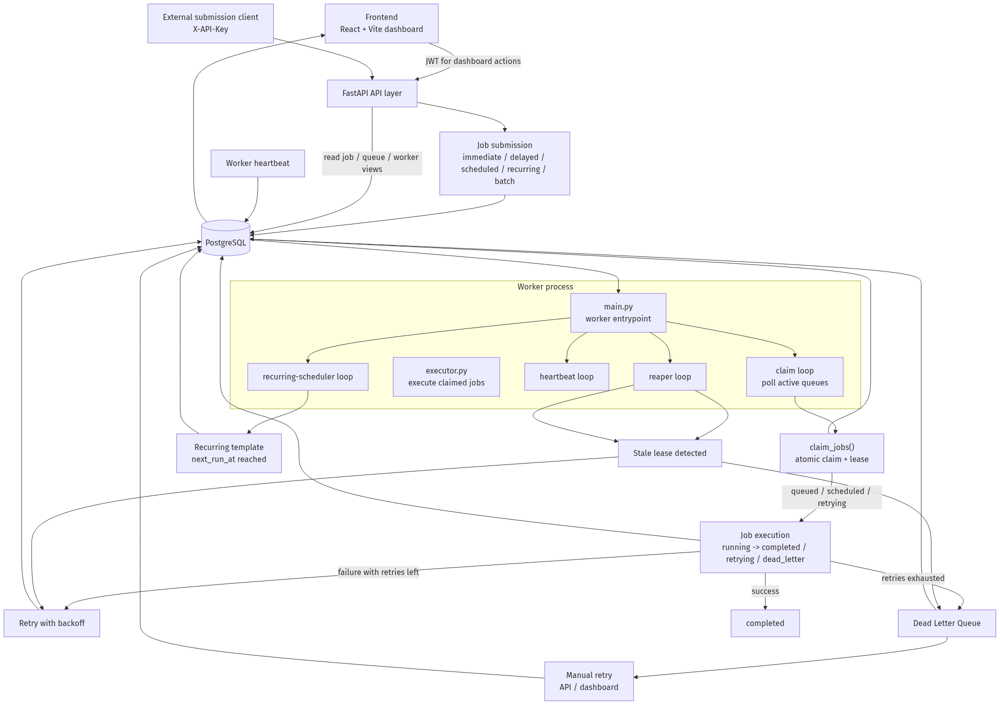
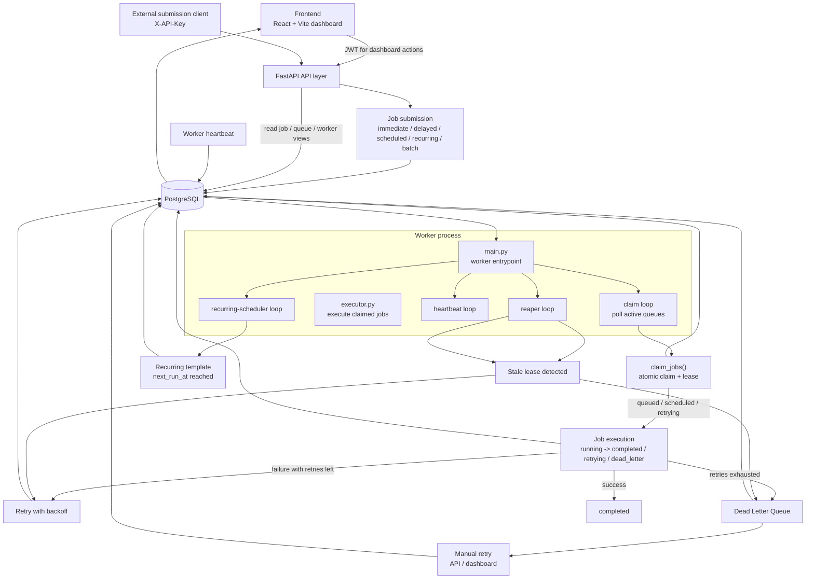

# Architecture

This document describes how the current system fits together in practice, based on the live worker implementation in:

- `backend/app/worker/main.py`
- `backend/app/worker/claim.py`
- `backend/app/worker/executor.py`
- `backend/app/worker/reaper.py`
- `backend/app/worker/recurring_scheduler.py`
- `backend/app/worker/heartbeat.py`

For the rationale behind some of the locking and auth choices, see:

- [Design Decisions](./DESIGN_DECISIONS.md)
- [ER Diagram](./ER_DIAGRAM.md)

## System View

## Request Flow

### Submission path

1. A dashboard user or external client submits a job through the FastAPI API.
2. The frontend uses JWT, while external submission clients use `X-API-Key`.
3. The submission router resolves the target org/project, validates queue ownership, and writes the job-related rows into PostgreSQL.
4. Immediate jobs are stored as `queued`, delayed/scheduled jobs are stored as `scheduled`, and recurring definitions create `RecurringJobTemplate` rows.
5. Batch submission creates multiple `Job` rows in one request.
6. Dedupe is enforced at submission time, so a matching in-flight job returns the existing row instead of creating duplicates.

The API is the entry point, but PostgreSQL is the source of truth for the job state machine.

### Claim and execution path

1. The worker process polls active queues in its main loop.
2. For each queue, `claim_jobs()` runs inside a single transaction.
3. That claim path first locks the queue row to serialize the `concurrency_limit` check, then uses `FOR UPDATE SKIP LOCKED` on candidate jobs so multiple workers do not block or double-claim the same rows.
4. Claiming sets `status='claimed'`, `claimed_by_worker_id`, `claimed_at`, and `lease_expires_at`.
5. The worker then dispatches the claimed jobs to `execute_jobs()`.
6. Each job executes in its own database session, transitions to `running`, creates a `JobExecution` row, and then records either completion, retry scheduling, or DLQ placement.

The locking rationale is described in more detail in [Design Decisions](./DESIGN_DECISIONS.md); this document keeps the focus on flow rather than re-arguing the trade-off.

## Worker Process Internals

The worker is one standalone process, but it runs four independent async loops alongside the main polling loop:

- Claim/execute loop: polls active queues, claims jobs, and launches execution tasks.
- Heartbeat loop: updates the worker record and inserts `WorkerHeartbeat` rows.
- Reaper loop: reclaims stale leases and applies the same retry/DLQ outcome logic used by normal execution failures.
- Recurring-scheduler loop: creates new `Job` rows from active recurring templates when `next_run_at` is due.

Each loop has its own interval from settings and can be tested independently because the core work is split into standalone functions:

- `claim_jobs()`
- `execute_jobs()` / `_execute_single_job()`
- `send_heartbeat()`
- `reclaim_stale_jobs()`
- `schedule_recurring_jobs()`

Inside `main.py`, the loops are started with `asyncio.create_task(...)` so they run concurrently instead of serializing worker health, scheduling, recovery, and execution.

## Job Lifecycle

The current lifecycle is:

`submission -> queued/scheduled -> claimed -> running -> completed/retrying/dead_letter`

Key transitions:

- `submission -> queued/scheduled`: API writes the job row, using `scheduled_at` to distinguish immediate work from future work.
- `queued/scheduled -> claimed`: worker claim loop reserves work and sets the lease.
- `claimed -> running`: execution session marks the job as actively running and creates a `JobExecution` attempt record.
- `running -> completed`: handler returns successfully.
- `running -> retrying`: handler fails, retry policy still has room, and the job is rescheduled with backoff.
- `running -> dead_letter`: handler fails and retries are exhausted, or the reaper decides the stale job is no longer recoverable.
- `dead_letter -> queued`: manual retry via API/dashboard resets the job for another pass.

The recurring scheduler creates new jobs into the queue, which then follow the same lifecycle as any other submission.

## Failure Handling

### Normal execution failure

When a job handler raises an exception:

1. The executor writes a failed `JobExecution` record.
2. It looks up the queue retry policy.
3. If retries remain, the job moves to `retrying`.
4. The next run time is pushed forward using the configured backoff strategy.
5. If retries are exhausted, the job moves to `dead_letter` and a `DeadLetterEntry` row is written.

The retry backoff strategy is fixed/linear/exponential depending on the queue policy, and the concrete delay computation lives in the retry service.

### Reaper path

If a worker disappears or stalls, the lease expires:

1. The reaper finds jobs in `claimed` or `running` with expired leases.
2. It reclaims them under row-level locking so multiple reaper processes do not double-handle the same job.
3. It applies the same retry/DLQ decision used by normal execution failures.

So the reaper does not invent a separate recovery model. It feeds the same retry and dead-letter outcomes from a different trigger condition: stale lease instead of handler exception.

### Manual retry

Jobs in the dead-letter queue can be retried manually from the API or dashboard.

That path resets the job back to `queued`, clears the claim fields, and gives the worker a fresh attempt cycle.

## Graceful Shutdown

Shutdown is signal-driven:

1. `SIGTERM` or `SIGINT` sets the worker shutdown flag.
2. The main poll loop stops claiming new work.
3. Background loops finish their current iteration or sleep interval.
4. In-flight execution tasks are allowed to drain until the configured timeout.
5. The worker is marked offline in the `workers` table.

If some executing tasks do not finish before the timeout, they are abandoned and the reaper later recovers them through lease expiry.

## Auth Architecture

There are two independent authentication paths:

- JWT for the human dashboard and general org-scoped API usage.
- `X-API-Key` for external job submission clients.

Job submission accepts either credential type:

- JWT is org-scoped.
- API keys are project-scoped, which is stricter than JWT.

That split keeps dashboard access and machine-to-machine submission separate without making submission clients carry user credentials. See [Design Decisions](./DESIGN_DECISIONS.md) for the reasoning behind the split.

## Horizontal Scaling

Multiple worker processes can run against the same database safely.

Why that works:

- The claim path uses row locking plus `SKIP LOCKED`.
- The reaper also uses `SKIP LOCKED`.
- The recurring scheduler uses `SKIP LOCKED` on template rows.
- Heartbeats are per worker row.

So the system does not rely on a single worker being present. Adding workers increases throughput while PostgreSQL remains the coordination layer.

## Where To Look Next

- [ER Diagram](./ER_DIAGRAM.md) for the current schema and relationships.
- [Design Decisions](./DESIGN_DECISIONS.md) for the rationale behind claim locking, retry semantics, and auth scope.
