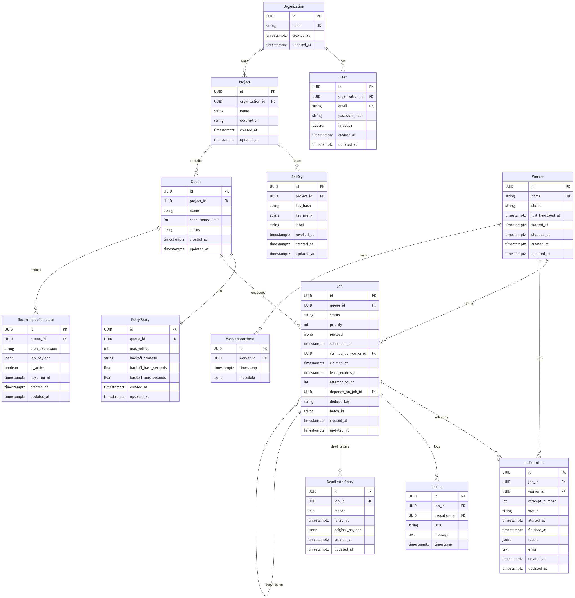

# ER Diagram

## Explanation

### Primary Keys

Every entity uses a UUID primary key generated with `uuid.uuid4()` in the model base (`backend/app/models/base.py`). That means the schema is using UUID v4 identifiers across the board.

Why this matters:

- No central ID allocator is needed.
- Separate workers or services can generate IDs independently without collisions in practice.
- UUIDs avoid the sequential-ID leakage that auto-increment integers create.
- The choice fits a distributed scheduler where job submission and worker activity can happen concurrently.

### Foreign Keys And Delete Behavior

The deletion rules below are verified against the current Alembic migrations and model files.

- `Organization -> User`: `ON DELETE CASCADE`
- `Organization -> Project`: `ON DELETE CASCADE`
- `Project -> Queue`: `ON DELETE CASCADE`
- `Project -> ApiKey`: `ON DELETE CASCADE`
- `Queue -> RetryPolicy`: `ON DELETE CASCADE`
- `Queue -> Job`: `ON DELETE CASCADE`
- `Queue -> RecurringJobTemplate`: `ON DELETE CASCADE`
- The `409 Conflict` queue-delete guard in the API is an application-level safety check for active jobs; if deletion is allowed to proceed, the database still applies the `CASCADE` rules above.
- `Job -> JobExecution`: `ON DELETE RESTRICT`
- `Job -> DeadLetterEntry`: `ON DELETE RESTRICT`
- `JobExecution -> Worker` via `worker_id`: `ON DELETE SET NULL`
- `Job -> Worker` via `claimed_by_worker_id`: `ON DELETE SET NULL`
- `Job -> Job` via `depends_on_job_id`: `ON DELETE SET NULL`
- `JobLog -> Job`: `ON DELETE CASCADE`
- `JobLog -> JobExecution` via `execution_id`: `ON DELETE CASCADE`
- `WorkerHeartbeat -> Worker`: `ON DELETE CASCADE`

What these rules mean:

- Organization deletion is a full teardown of its users, projects, queues, keys, and downstream queue data.
- Projects and queues are also teardown boundaries, so child operational data disappears with the parent.
- `JobExecution` and `DeadLetterEntry` are audit-history records, so they use `RESTRICT` to preserve execution and failure history if a job still has history attached.
- Worker references are intentionally nullable in execution and claim rows so that deregistering or deleting a worker does not erase job history.

### Indexes And Constraints

The meaningful indexes and unique constraints currently present are:

- `ix_jobs_claimable` on `Job(queue_id, status, scheduled_at, priority)`
  - This is the index the atomic claim path depends on under load.
  - It supports scanning claimable jobs for a queue while filtering by status and schedule time.
  - The claim path still relies on row-level locking with `FOR UPDATE SKIP LOCKED`; the index simply makes the candidate scan fast.

- `ix_jobs_status` on `Job.status`
  - Supports direct status filtering and status-based reporting.

- `ix_jobs_batch_id` on `Job.batch_id`
  - Supports batch lookups and batch-level filtering.

- `uq_job_queue_dedupe_key` on `Job(queue_id, dedupe_key)`
  - Enforces idempotent submission within a queue.
  - Because SQL unique constraints allow multiple `NULL` values, jobs without a dedupe key are not artificially blocked.

- Unique constraint on `Organization.name`
  - Prevents duplicate organization names.

- Unique constraint on `User.email`
  - Ensures one account per email address.

- Unique constraint on `Worker.name`
  - Prevents duplicate worker registration names.

- Unique constraint on `RetryPolicy.queue_id`
  - Enforces the intended one-to-one relationship between queue and retry policy.

- `ix_queues_status` on `Queue.status`
  - Useful for queue lifecycle filtering and worker-side queue selection.

### Normalization

The schema is generally in **third normal form (3NF)**:

- No repeated groups are stored in a single row.
- Entities are separated by responsibility: organizations, projects, queues, jobs, executions, logs, workers, and templates each live in their own table.
- Metrics are not stored as mutable summary rows; queue stats and queue metrics are computed by aggregate queries at read time.

Deliberate exceptions:

- `Worker.last_heartbeat_at` is a denormalized convenience column updated alongside `WorkerHeartbeat` inserts so worker-status queries can be fast without aggregating heartbeats each time.
- `ApiKey.key_prefix` is a stored lookup helper derived from the raw key format. It is not a business datum; it exists to make secure API-key lookup efficient.

These are intentional read-performance optimizations, not normalization mistakes.

### Performance Considerations

- `Job` is the hottest table in the system:
  - highest write rate from submissions, retries, recurring scheduling, and requeues,
  - highest read rate from the claim loop, job explorer, and status polling.

- The claim path is designed around:
  - `ix_jobs_claimable` for fast candidate selection,
  - `SELECT ... FOR UPDATE SKIP LOCKED` for avoiding worker pile-ups,
  - queue-row serialization for respecting `concurrency_limit` in the same transaction.

- At very high volume, `Job` would be the first likely candidate for partitioning.
  - Practical partition keys would be `queue_id` or time-based partitions.
  - That is a forward-looking scalability note only; it is **not** implemented in the current schema.

### Current Schema Summary

The live schema now includes:

- Organization
- User
- Project
- ApiKey
- Queue
- RetryPolicy
- Job
- JobExecution
- JobLog
- Worker
- WorkerHeartbeat
- DeadLetterEntry
- RecurringJobTemplate

That is 13 tables total in the current migration history.
