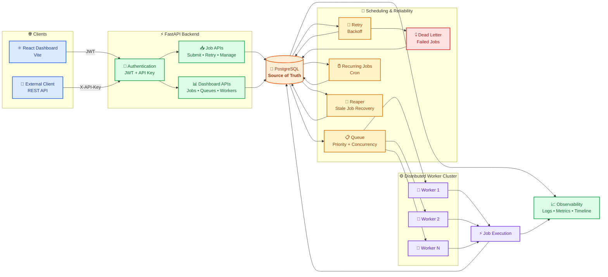

# Simple System Architecture

This document provides a high-level, simplified architectural overview of the **Distributed Job Scheduler** system.

For the detailed technical deep-dive and locking mechanics, see [ARCHITECTURE.md](./ARCHITECTURE.md).
